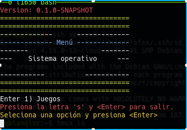

# JugandoEnLinux

Shell Scripts para poder jugar en linux con wine puro.

Para poder ejecutarlo tenemos dos opciones:

1) clonar el repositorio:

```Shell
git clone https://github.com/rafex/JugandoEnLinux.git -b master
cd JugandoEnLinux
cd bin
./vamos-a-jugar.sh
```

2) Descargar la versión de lanzamiento (release) aquí:

```Shell
tar -xvf JugandoEnLinux_0.1.0-SNAPSHOT.tar.gz
cd bin
./vamos-a-jugar.sh
```

Y al ejecutarlo verán algo así:


